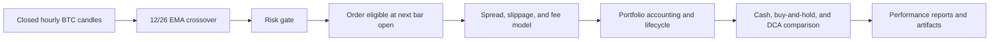

# Market BTC Autotrader — Research Status (2026-08-16)

**Status:** Exploratory research engine only. **Not proven profitable. Not ready for live trading.**

The system is a substantially more trustworthy research engine—not a validated investment strategy.

## How the system works

The implemented research path:

The default strategy in `src/market/strategy/slow_trend.py` is long-only:

- Buy when the fast EMA crosses above the slow EMA while flat.
- Sell when the fast EMA crosses below the slow EMA while holding BTC.
- Signals use closed hourly candles.
- The corrected backtester waits until the next bar’s open before filling.
- Every fill receives spread, slippage, and venue-specific cost treatment.
- Terminal inventory is sold through a real, costed liquidation event.
- Cash, inventory, fees, realized/unrealized P&L, and net liquidation value reconcile through an immutable journal.
- Results are compared with cash, matched-notional buy-and-hold, and periodic DCA.

### Operational modes

- `sim`: synthetic prices and fake fills.
- `paper`: Coinbase public candles/quotes with fake fills.
- `live-dry`: records signals without submitting.
- `live`: deliberately blocked.
- Robinhood: only a locked skeleton exists; the signed official API client has not been implemented.

Research and target architecture: see `docs/ARCHITECTURE.md`

## Is it profitable?

**No demonstrated edge exists.**

Available evidence:

- The old 1,500-bar run made approximately `$0.62` on `$1,000`, but that result is invalid because it used look-ahead timing, incomplete costs, incorrect terminal accounting, and an unrecoverable dataset.
- The old 600-bar run lost approximately `$1.60`.
- The recent six-bar G2.8 replay lost `$0.46`, but it is only a synthetic mechanics test—not a profitability study.
- A verified five-year dataset now exists with 43,811 hourly bars and 13 declared missing hours split across four safe segments.
- That five-year dataset has not yet gone through walk-forward, holdout, uncertainty, parameter-stability, and cost-stress research.

**Conclusion:** The bot may or may not contain a usable future strategy, but the current EMA strategy has not earned the right to risk money.

See also: `docs/RESEARCH-STATUS.md`

## What remains (Immediate work)

1. **G2.10 — Make every run fully reproducible**
   Record the code revision, dataset checksum, complete configuration, engine version, costs, seed, trades, equity, and metrics.

2. **Approve the complete G2 gate**
   Independent QA and execution review—not just passing unit tests.

### After G2

- **G3:** Run the real five-year strategy study with walk-forward splits, untouched holdout, parameter-neighborhood testing, bootstrap confidence bounds, realistic and doubled costs, regime analysis, and benchmarks. This is the phase that determines whether an edge exists.
- **G4:** Rebuild paper trading with persistent SQLite state, closed-hour aggregation, freshness enforcement, restart recovery, and event replay.
- **G5:** Implement the official Robinhood API in read-only mode and shadow it for seven days.
- **G6:** Add durable order states, idempotency, reconciliation freezes, restart-safe P&L, total exposure controls, and panic flatten.
- **G7:** Add watchdogs, alerts, operator controls, backups, runbooks, and failure-injection testing.
- **G8:** Complete at least 90 consecutive paper/shadow days and 50 round trips with positive net expectancy.
- **G9:** Only then consider manually supervised micro-live trading.
- **G10:** Optional controlled scaling if live evidence supports it.

The complete sequence is in the production-readiness roadmap: `docs/plans/2026-08-16-production-readiness-roadmap.md`

### Completed since this snapshot was created

- **G2.9:** The golden/failure acceptance matrix now covers accounting, anti-look-ahead timing,
  spread/slippage direction, partial executions, next-open insufficient cash, and terminal fees.

**The correct next step is G2.10, followed by the complete G2 review and then the decisive G3 profitability study.**

---

*Generated from project status review on 2026-08-16. Path: /Users/nexteleven/Desktop/market*
